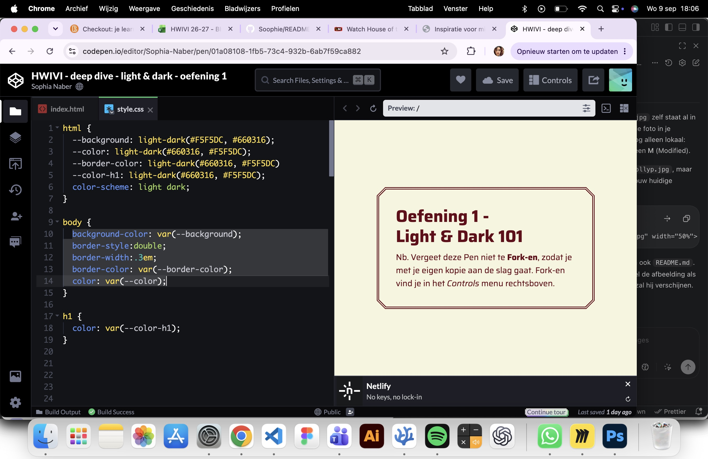
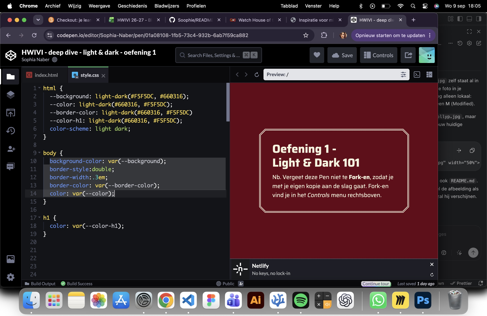
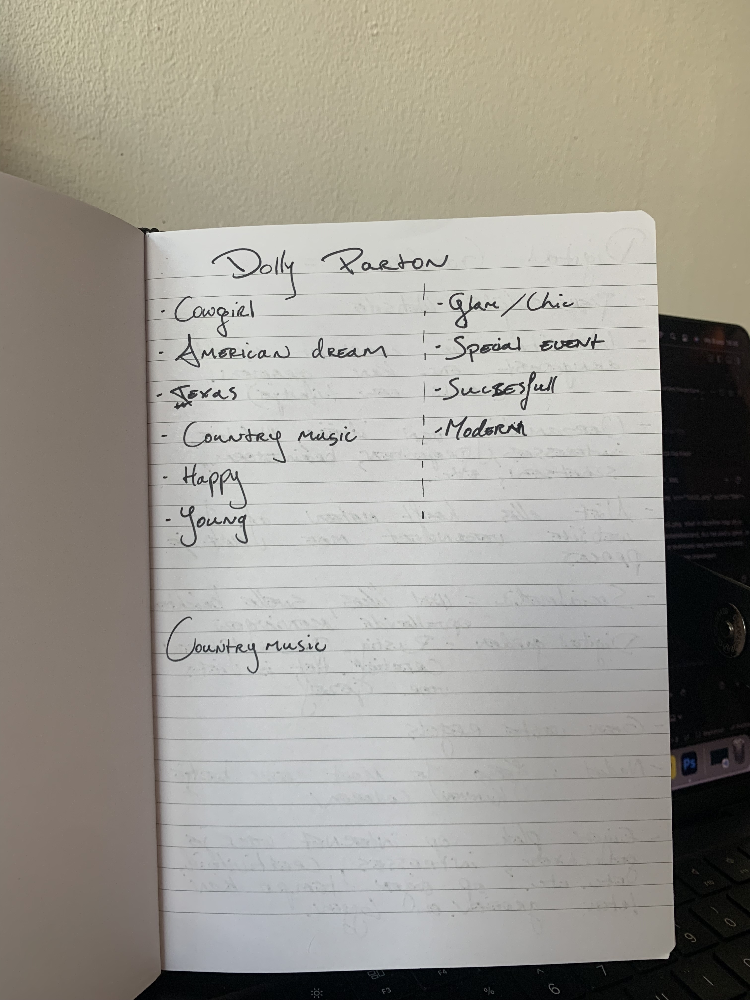

## Learning Log

### 9 sept

### 8 sept Deep dive: light and dark mode

### 7 sept
Samenwerking in groepjes van 4:

1. Leg uit wat een digital garden is en waarom dat anders is dan een reguliere website:
Het is heel erg persoonlijk. Er hoeft geen perfectie in te zitten. Je kan er je eigen ideeen erin verwerken.

2. Leg uit wat een website 'webby' maakt en welke websites jou het meeste inspireren:
Dat iemand een website Webby vind verschilde heel erg per persoon dus wij denken dat het heel erg een mening is. Maar over het algemeen dat het voor iedereen belangrijk is dat er een eigen insteek en persoonlijkheid in gestoken is.

3. Vertel waar jij mee aan de slag wilt gaan bij het maken van jouw eigen digital garden. let op: dit zijn jouw eerste ideeën, dit kan en mag veranderen in de loop van het programma:
Op dit moment heb ik bedacht het thema bergen te gaan gebruiken. Ik wil in mijn website laten zien wat voor activiteiten er allemaal gedaan kunnen worden in de bergen. Met animaties en collages wil ik de schoonheid en uniekheid van bergen laten zien.

### 4 sept Deep dive: praktische css, fonts met kleur en effecten
Ik heb bij de praktische css oa veel mee geluisterd.

Een screenshot van een paar tags waarbij ik heb mee geschreven:

### 2 sept Deep dive: Typography
Voor deze les heb ik informatie vezamelt over Dolly Parton die ik al wist over haar. Daarmee heb ik schetsjes gemaakt om die kennis visueel duidelijk te maken. 

### 31 aug - Kickoff

1. Leg uit wat een source hosting platform is en voor welke jij gekozen hebt.
wij hebben beide voor github gekozen. het is een platform die je nodig hebt om een website te maken.

2. Vertel welke domeinnaam jij gekozen hebt en hoe je die hebt gekoppeld aan jouw pagina.
Voor mijn domeinnaam heb ik gewoon mijn roepnaam gebruikt omdat ik niet wist waar de opdracht over zou gaan. 

3. Beschrijf hoe je aanpassingen aan jouw pagina kunt maken en hoe je er voor zorgt dat die op het web gepubliceerd worden.
Ik schrijf een code en synchronyseer het.

