## Learning Log

### 21 sept check out
1. Wat zijn HTML landmark role elements?

De tags die dingen groeperen: main,footer,header etc.

2. Wat zijn heading elementen en hoe horen deze 'genest' te worden?

belangrijkste is H1 en daarna H2, etc

3. Hoe ga jij met cookies om? Beschrijf jouw beweegredenen en of die zijn veranderd na het volgen van dit college.

Ik klik altijd op alles afwijzen, ook al voor deze les.

### 18 sept check out

Oriënteren en begrijpen

Waarom geven de docenten deze opdracht?

Het is een hele brede opdracht met coderen, ontwerpen en een groot proces omdat het digitale tuintje constant wordt aangepast. Het is hierdoor een hele leerzame opdracht waar je ook alle competenties in kan toepassen.

Welke technieken gebruik ik?

Ik heb tot nu toe een Photoshop collage en 2 simpele illustrator ontwerpen toegevoegd in mijn website. Code schrijven vind ik af en toe nog best wel lastig, vooral omdat ik er heel veel voor moet lezen. Maar ik vind het wel heel leuk zodra ik het snap en zie wat ik er allemaal mee kan. Daarom wil ik graag nog wel meer tijd daaraan besteden. Op mijn website heb ik nu een light en dark mode toegevoegd, ik begrijp nu wel beter hoe dat werkt.

Wat zijn de randvoorwaarden?

Voor de volgende opdracht wil ik vooraf beter letten op de randvoorwaarden. Tijdens dit project merkte ik dat de kaders en restricties, zoals technische eisen, nog niet altijd helder voor me waren, waardoor ik tijdens het coderen soms twijfelde over de juiste keuzes.

Waar gebruik je HTML/CSS voor?

Op mijn website heb ik HTML gebruikt om de basisstructuur en inhoud neer te zetten, zoals de titels en afbeeldingen. Met CSS heb ik vervolgens de visuele presentatie verzorgd: ik heb de afmetingen van de afbeeldingen afgestemd op de layout en via @font-face een eigen lettertype toegevoegd om de typografie te versterken.

Verbeelden en conceptualiseren

Lukt het om ideeën te bedenken?

Ik was vanaf het begin erg enthousiast over mijn concept en wilde het meteen uitwerken. Het enthousiasme zorgde wel voor een tunnelvisie: omdat ik direct zo tevreden was met mijn eerste idee, ben ik te snel gestopt met divergeren. Ik had in de verkennende fase breder moeten schetsen en meer alternatieven moeten onderzoeken voordat ik mijn definitieve keuze maakte.

Lukt het om je ideeën te schetsen?

Wanneer ik een idee krijg, leg ik dit altijd vast in een schets zodat ik het niet vergeet. Wel merk ik dat mijn schetsen nu nog niet goed gedetailleerd zijn. Ik wil dus mijn volgende schetsen wat gedetailleerder gaan maken. Zodat ik in mijn schets al een beetje kan zien of het idee eigenlijk wel werkt. 
Hier is een compleet ingevulde reflectie op basis van de vragen uit jouw screenshots en jouw project (het digitale tuintje met bergen, de collage en de zon die overgaat in een maan bij dark mode).

Wat doet deze CSS-property?

Tijdens het ontwerpen van mijn digitale tuintje heb ik veel gebruik gemaakt van CSS-property om light en dark mode toe te kunnen passen. Door CSS-properties te gebruiken kon ik makkelijk de kleuren kiezen en aanpassen zonder dat ik dit op meerdere punten moest veranderen.
Welke content en welke HTML heb ik nodig?
Ik heb gekozen voor een minimalistische opzet waarin de visuele sfeer centraal staat. Mijn website heeft wel een titel maar dat is voor nu nog de enige tekst. Zo wil ik de focus grotendeels op de beleving van het digitale landschap leggen.

Hoe kan ik dit soort content vormgeven?

Voor de collage van bergen heb ik gebruikgemaakt van photoshop. Het zijn foto’s die ik zelf heb gemaakt op verschillende vakanties. Het geeft mij daardoor een vrolijk en rustgevend gevoel, ik kan al die bergen dan bij elkaar zien. 

Wat als ik hier nu eens 1000 invul?

Ik merk dat ik de neiging heb om complexe ideeën te bedenken voor mijn huidige niveau in HTML en CSS. Bij mijn voorpagina wilde ik bijvoorbeeld een animatie maken waarin de zon en maan als interactieve knoppen opkwamen en ondergingen met een zonsondergang-effect. Doordat ik hier heel veel tijd aan kwijt was zonder het gewenste resultaat te bereiken, heb ik uiteindelijk een hele simpele pagina waar ik niet helemaal tevreden mee ben.

Prototypen en Uitwerken

Begrijpen bezoekers de site en wat vindt de opdrachtgever/beoordelaar?

Ik heb mijn website nog niet getest. Dit is voor mij dus belangrijk om te gaan doen en op tijd zodat ik nog wel tijd heb om het aan te passen.

Oooooh, kan dit óók?!

Ik vond het heel interessant om te leren wat er met css gedaan kan worden en het zorgt ervoor dat ik graag meer hierover wil leren.

Evalueren

Wat wilde ik weten/bereiken?

Ik wilde onderzoeken hoe ik light mode en dark mode op een speciale en mooie manier kon toepassen op mijn digitaal tuintje. Dit wilde ik doen door een groot verschil te maken tussen light en dark mode met een overgang tussen de twee. Ik ben niet zo tevreden met wat ik heb bereikt, omdat ik eigenlijk nog veel effecten wilde toevoegen. Nu ziet het er allebei nog best saai uit naar mijn mening.

Wat heb ik gedaan?

Ik heb schetsen gemaakt van de schermen met de bergen, beeldmateriaal verzameld voor de collage en geëxperimenteerd met verschillende kleuren mbv CSS custom properties. Ik had wel meer willen experimenteren met een grid layout. Dit was alleen niet iets wat nog op mijn voorpagina nodig was. Daarom ga ik dit op de volgende pagina’s toevoegen.

Wat was het resultaat?

Een werkende, responsieve webpagina met een berglandschap dat transformeert afhankelijk van de gebruikersvoorkeur of dark mode toggle. De zon verandert vloeiend in een maan en de sfeer van het landschap past zich naadloos aan.

Wat weet ik nu?

Ik weet hoe ik kleuren kan laten veranderen binnen light en dark mode.

Wat vond ik (niet) leuk?

Ik vond het leuk om te werken aan een idee waar ik heel verheugd van werd. Ik vond het niet leuk dat ik eraan moest werken met veel stress en tijdsdruk.

### 16 sept dark en light mode toegepast op website
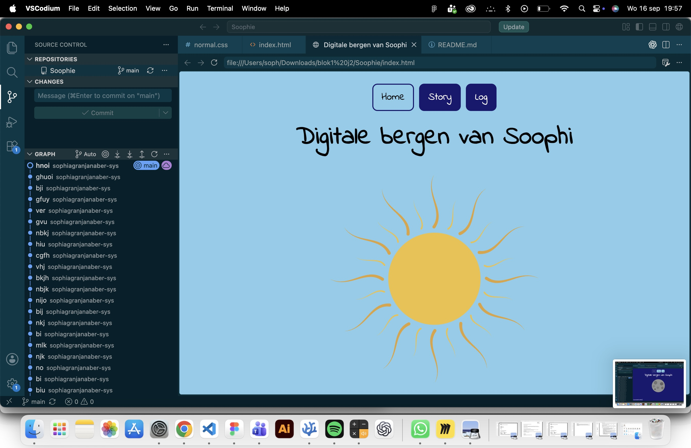
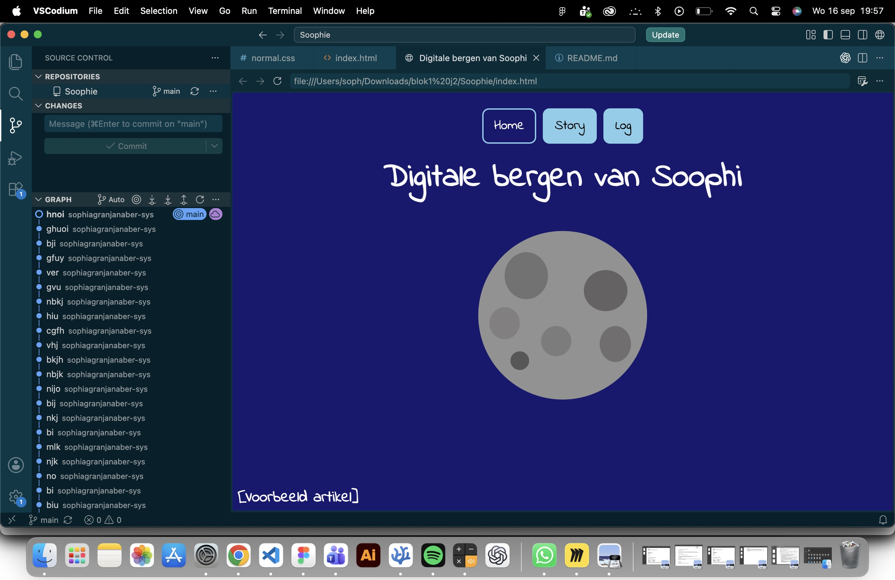

### 15 sept Deep dive
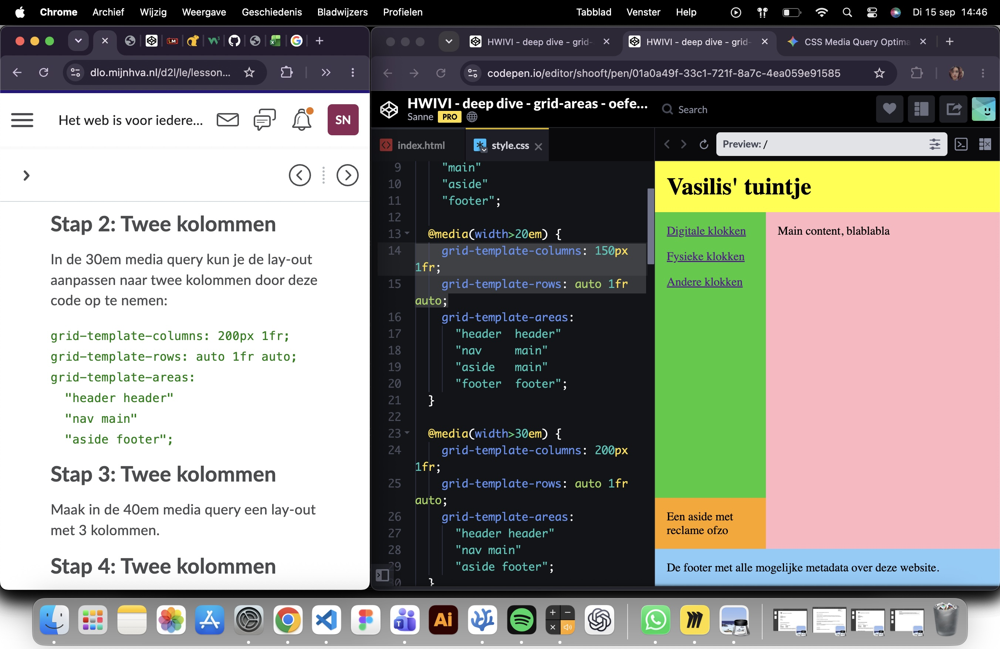
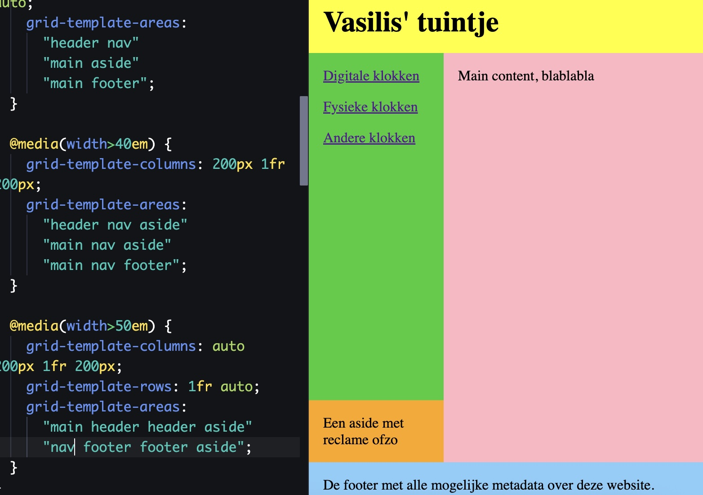

### 14 sept
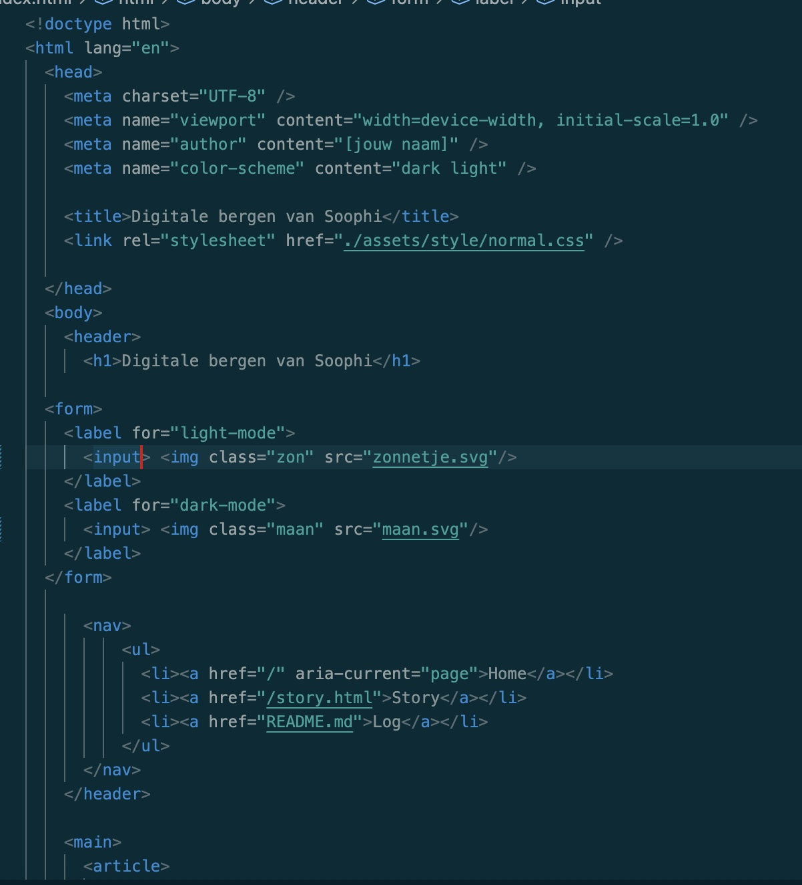
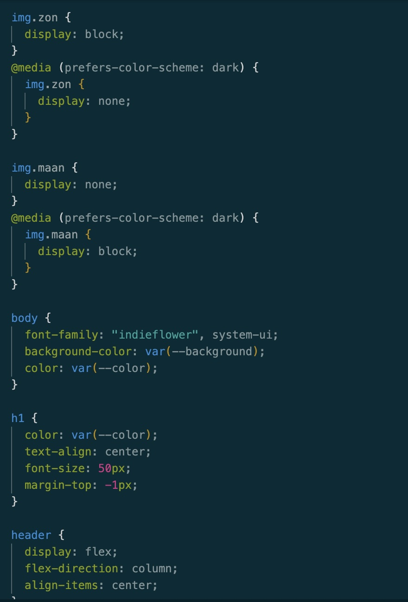

1. Leg uit wanneer een website 'lelijk' wordt en geef voorbeelden wat je kan doen om deze 'lelijke' onderdelen te fixen?

geordent houden, adaptief top maat/goede verhouding, css ook gebruiken, juiste maat voor afbeeldingen

2. Vertel welke volgende stap je neemt om je website responsive te maken.

de deepdives toepassen, css gebruiken

3. Kun je het ontwerp en de bouw van je eigen Garden (zo uit je hoofd) onderbouwen in Webby vocabulair?

Ik heb aan mijn tweetal beschreven wat mijn plan is voor mijn website

### 13 sept
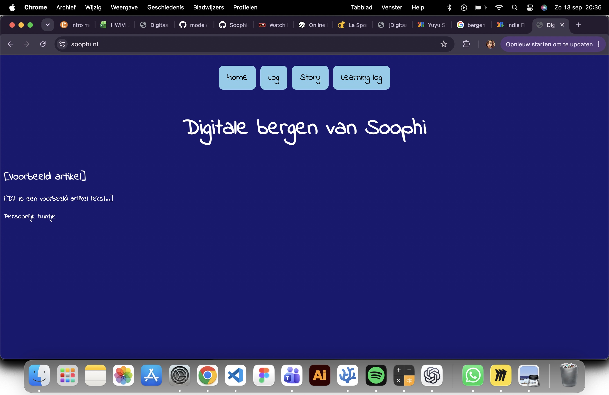

### 11 sept deep dive grid en les

### 10 sept Deep dive gradient en scherm schetsen
Geoefend met verschillende gardients maken:

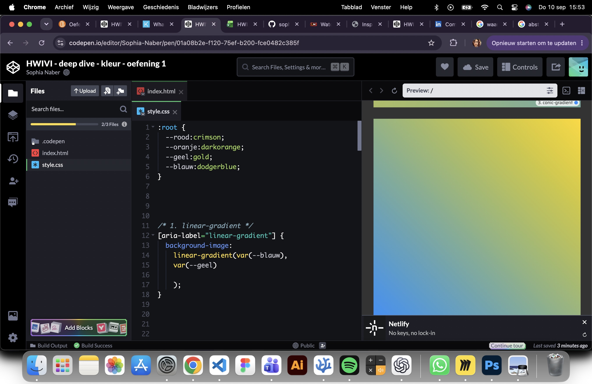

### 9 sept online les
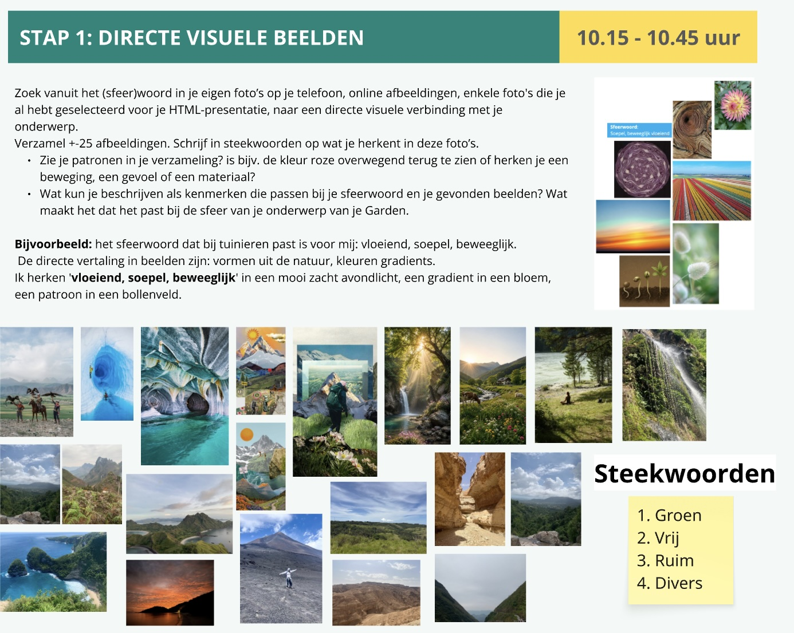
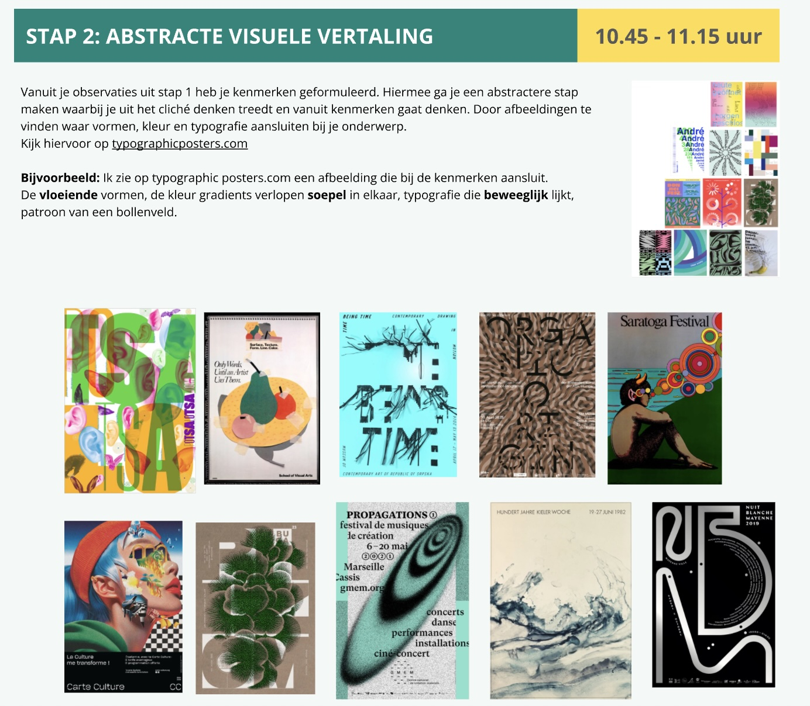

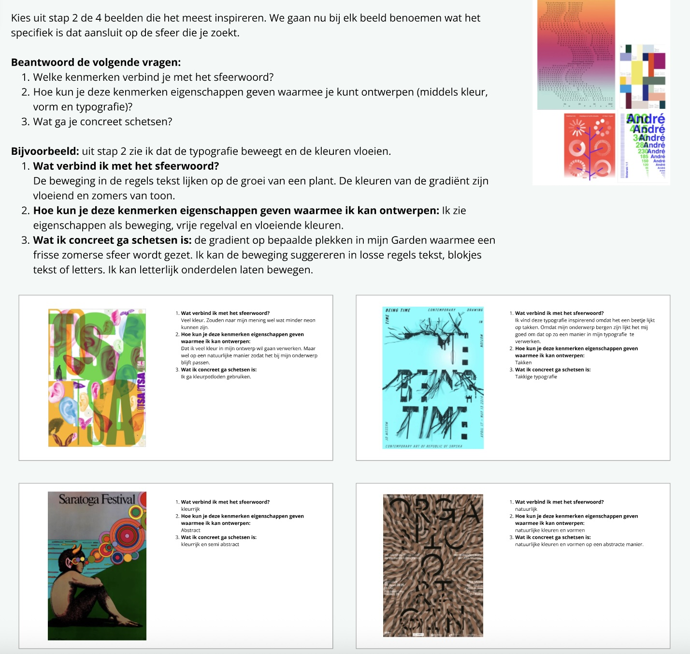

1. Leg uit waar het Visual Research in 3 stappen naartoe werkt

Beelden, foto's, schetsen verzamelen. Verzameling van informatie. Lijdt tot patronen vinden om jou stijl en ontwerp te kunnen analyseren.

3. Vertel in 2 zinnen waar jouw Garden over gaat, en met welke content je dat gaat doen (beeld, tekst, sound, animatie enz).

Kijkers overhalen meer activiteiten in de bergen te doen om ervoor te zorgen dat er meer respect ontstaat voor de natuur. Aan de hand van collages en informatie over hoe makkelijk het is om de bergen in te gaan.

5. Vertel kort welk idee van de Crazy 8 je het liefst zou willen uitvoeren/ verder zou willen onderzoeken.

In mijn eerste schets heb ik een zon die in een maan veranderd, geschetst. Het idee daaracht is dat als je er op klikt je overstapt van ligt naar dark mode. Dit vond ik zelf echt een leuk idee dus ik zou het wel heel leuk vinf=den als ik dit in mijn tuintje kan verwerken.

### 8 sept Deep dive: light and dark mode

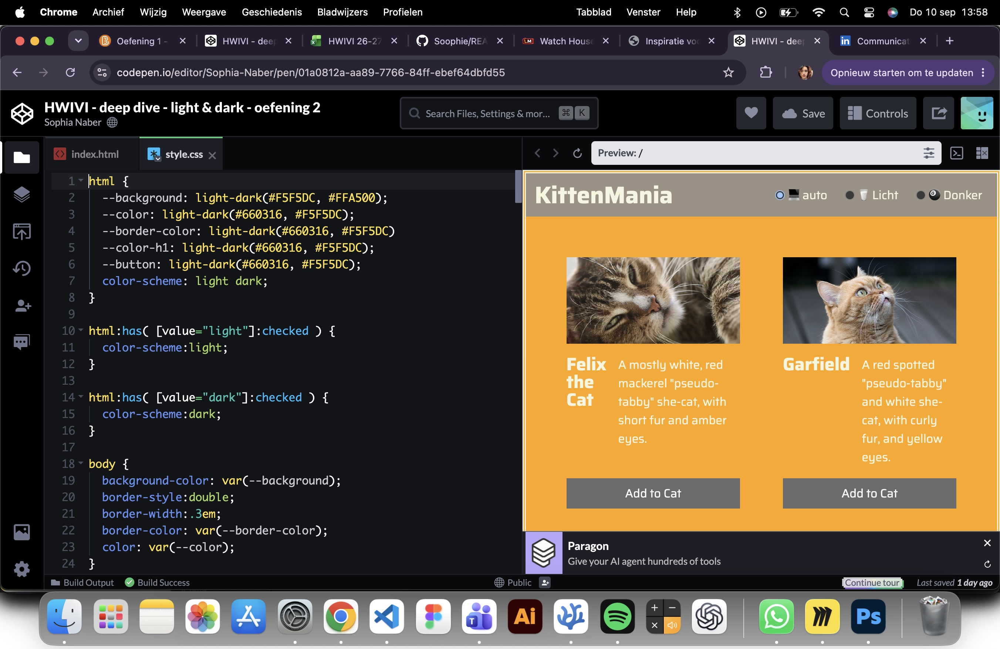

### 7 sept
Samenwerking in groepjes van 4:

1. Leg uit wat een digital garden is en waarom dat anders is dan een reguliere website:

Het is heel erg persoonlijk. Er hoeft geen perfectie in te zitten. Je kan er je eigen ideeen erin verwerken.

2. Leg uit wat een website 'webby' maakt en welke websites jou het meeste inspireren:

Dat iemand een website Webby vind verschilde heel erg per persoon dus wij denken dat het heel erg een mening is. Maar over het algemeen dat het voor iedereen belangrijk is dat er een eigen insteek en persoonlijkheid in gestoken is.

3. Vertel waar jij mee aan de slag wilt gaan bij het maken van jouw eigen digital garden. let op: dit zijn 
jouw eerste ideeën, dit kan en mag veranderen in de loop van het programma:

Op dit moment heb ik bedacht het thema bergen te gaan gebruiken. Ik wil in mijn website laten zien wat voor activiteiten er allemaal gedaan kunnen worden in de bergen. Met animaties en collages wil ik de schoonheid en uniekheid van bergen laten zien.

### 4 sept Deep dive: praktische css, fonts met kleur en effecten
Ik heb bij de praktische css oa veel mee geluisterd.

Een screenshot van een paar tags waarbij ik heb mee geschreven:

### 2 sept Deep dive: Typography
Voor deze les heb ik informatie vezamelt over Dolly Parton die ik al wist over haar. Daarmee heb ik schetsjes gemaakt om die kennis visueel duidelijk te maken. 

### 31 aug - Kickoff

1. Leg uit wat een source hosting platform is en voor welke jij gekozen hebt.

wij hebben beide voor github gekozen. het is een platform die je nodig hebt om een website te maken.

2. Vertel welke domeinnaam jij gekozen hebt en hoe je die hebt gekoppeld aan jouw pagina.

Voor mijn domeinnaam heb ik gewoon mijn roepnaam gebruikt omdat ik niet wist waar de opdracht over zou gaan. 

3. Beschrijf hoe je aanpassingen aan jouw pagina kunt maken en hoe je er voor zorgt dat die op het web gepubliceerd worden.

Ik schrijf een code en synchronyseer het.

